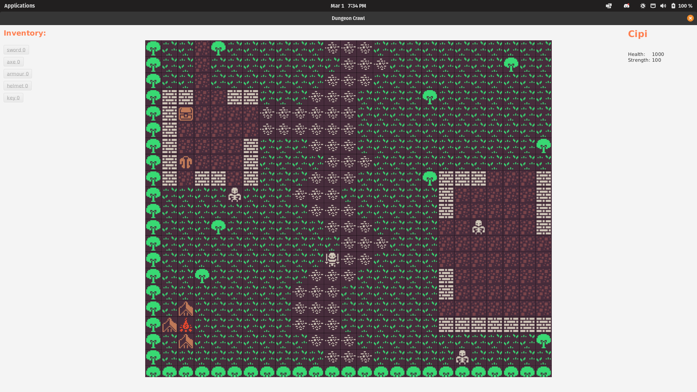

# Dungeon Crawl

## About

- Dungeon Crawl is a roguelike(or dungeon crawler) game that sets you, the Hero, inside the Dungeon of Doom. You can:
    - Move around
    - Fight enemies
    - Collect armor, weapons and food/heals
    - Use a cheatcode with the developer's name

## Controls

Arrow keys for moving, interacting and fighting enemies

##  Technologies used

- Git and Github
- SQL
- Java
- JavaFX
